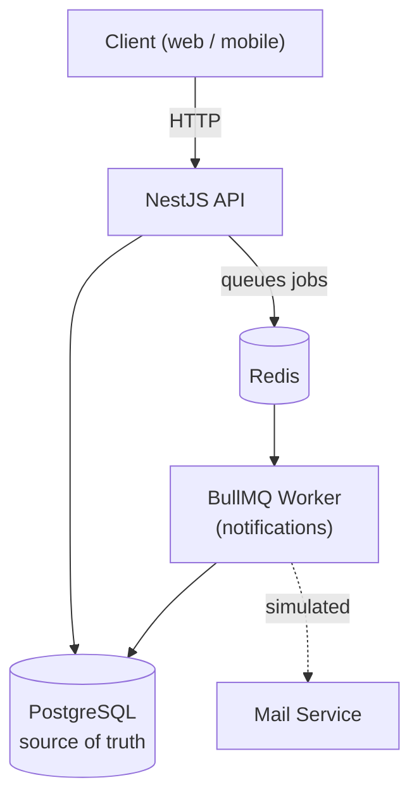
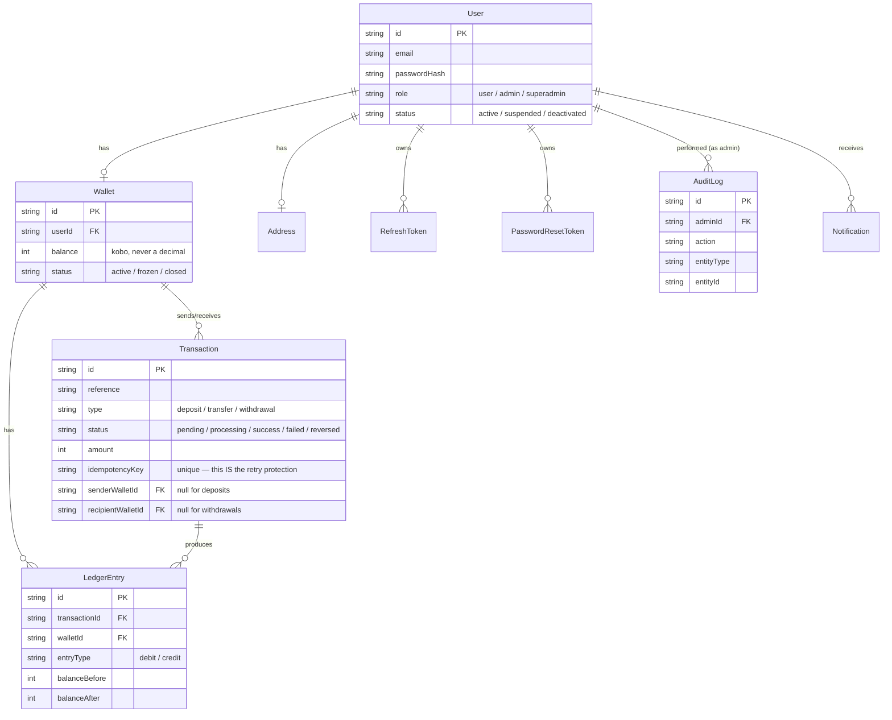

# Nest Fintech API

A backend for a digital wallet app — the kind of thing that sits behind a banking or payments app. You can create an account, get a wallet, fund it, send money to other users, withdraw, and see your transaction history. Admins can manage users and wallets, and everything sensitive they do gets written to an audit trail.

This was built as a hands-on learning project to practice the parts of backend engineering that are easy to read about but hard to actually get right: money that can't go negative, requests that can't accidentally double-charge someone, and two people trying to spend the same balance at the same time.

Nothing here touches a real bank. Deposits and withdrawals are simulated — this is a portfolio project, not a production payments system.

## What it does

- **Accounts** — register, log in, log out (one device or all of them at once), reset a forgotten password
- **Wallets** — every user gets one automatically; check your balance, fund it, withdraw, send money to someone else by email
- **Money safety** — deposits, withdrawals and transfers are all idempotent (retry one safely, it won't double-process) and every balance change is backed by a ledger entry, so there's always a paper trail
- **Concurrency protection** — two transfers racing against the same balance can't both succeed and overdraw a wallet
- **Transaction history** — a paginated list of your own transactions, plus a detail view
- **Notifications** — an in-app notification (and a simulated email) whenever something happens to your wallet
- **Admin tools** — a dashboard, user/wallet search, suspend or reactivate a user, freeze/unfreeze/close a wallet, and a full audit log of every admin action
- **Roles** — regular users, admins, and a superadmin who's the only one who can create other admins
- **Rate limiting** — login, password reset, and money-movement endpoints are all throttled against abuse

## The stack

| Piece | What it's for |
|---|---|
| [NestJS](https://nestjs.com/) + TypeScript | the API itself |
| PostgreSQL + [Prisma](https://www.prisma.io/) | the database and how the app talks to it |
| Redis + [BullMQ](https://bullmq.io/) | background job queue (notifications run async, not inline with a request) |
| JWT | access + refresh tokens for auth |
| Docker / Docker Compose | runs the whole stack (API, Postgres, Redis) with one command |
| GitHub Actions | lints, type-checks and builds the project on every push/PR |

## Getting started

You'll need Docker installed. Everything else runs inside containers.

**1. Clone it and install dependencies** (needed locally too, so your editor can see types):
```bash
git clone <this-repo>
cd nest-fintech-api
npm install
```

**2. Set up your environment file:**
```bash
cp .env.example .env
```
Open `.env` and fill in real values — at minimum, set your own `JWT_SECRET` (any long random string) and a `SUPERADMIN_EMAIL`/`SUPERADMIN_PASSWORD` (this account gets created automatically the first time the app starts, so you have someone to log in as an admin with).

**3. Start everything:**
```bash
docker compose up --build
```
This boots the API, Postgres, and Redis together. The first time you run it, the database won't have any tables yet — open a second terminal and run:
```bash
npx prisma migrate dev
```
That creates all the tables. After that, `docker compose up` is all you need going forward.

**4. Check it's alive:**

Visit `http://localhost:3000/api-docs` — that's a full interactive API explorer (Swagger). You can try every endpoint from there directly.

### Running without Docker (just for the API itself)

If you'd rather run the API on your machine directly and only containerize Postgres/Redis:
```bash
docker compose up postgres redis -d
npm run start:dev
```

## How the pieces fit together



The API talks to Postgres directly for everything that matters right now — balances, transactions, users. Redis only backs the job queue: when something happens that a user should be told about (money received, a withdrawal reversed), the API doesn't send that notification itself — it hands off a small job to a queue and moves on immediately. A separate worker picks that job up and does the slower work (writing the notification, "sending" the email) without ever making the original request wait on it. If Redis or the worker is briefly unavailable, the actual money-moving request still succeeds — only the notification is delayed.

## The data model



A couple of things that aren't obvious just from looking at the boxes:

- **`Transaction` is one shared table for deposits, transfers, and withdrawals** — not three separate tables — distinguished by `type`. A deposit only ever has a `recipientWalletId` (money comes from nowhere, simulated), a withdrawal only ever has a `senderWalletId` (money leaves the system), and only a transfer has both.
- **`LedgerEntry` rows are never edited, only added to.** Every balance change writes a new row recording exactly what the balance was before and after. If a withdrawal gets reversed, that's a *second* ledger entry crediting the money back — the original debit is never touched. This is what makes the whole system auditable: you can always reconstruct exactly how a balance got to where it is.

## API documentation

Every endpoint is documented and testable at `/api-docs` once the app is running — that's the real source of truth, since it's generated straight from the code and can't drift out of date the way a hand-written list in this file would. Here's the shape of what's there:

| Area | Examples |
|---|---|
| `/auth/*` | register, login, refresh, logout, logout-all, forgot/reset password |
| `/wallet/*` | view wallet, balance, deposit, withdraw, transfer |
| `/transactions/*` | list your transactions, view one |
| `/notifications/*` | list your notifications, mark one read |
| `/admin/*` | dashboard, user/wallet search and management, audit log, create an admin |

Money-movement endpoints (`deposit`, `withdraw`, `transfer`) all expect an `Idempotency-Key` header — a value you generate once per attempt (a UUID is fine) and reuse only if you retry that *same* attempt. It's how the API can tell "the network dropped my first request, let me try again" apart from "I meant to send money twice."

## Design decisions worth knowing about

A few choices here weren't the "obvious" first approach, and it's worth explaining why, both for anyone reading this and for future-me:

**Money is stored as an integer, in kobo, never a decimal.** ₦100 is stored as `10000`. This sidesteps floating-point rounding errors entirely — `0.1 + 0.2` famously doesn't equal `0.3` in most programming languages, and that's not a bug you want anywhere near real balances. Converting to naira for display is a UI concern, not this API's job.

**Preventing double-spend doesn't use a database lock — it uses one atomic conditional update.** Instead of "read the balance, check in code if it's enough, then write" (which has a gap two requests can both slip through), the debit is a single database statement: *"take this money, but only if the balance is still high enough right now."* The database itself guarantees only one of two simultaneous requests can win that check. Tested for real, not just reasoned about — firing two genuinely concurrent transfer requests against a wallet with insufficient balance for both consistently produces exactly one success and one clean rejection.

**Idempotency is enforced by the database, not application logic.** Every transaction's idempotency key has a uniqueness constraint at the database level. The code doesn't "check if this key was used, then insert" (that has the same race-condition gap as the balance problem above) — it tries the insert directly and catches the database's rejection if the key's already taken. The database is the only thing that can make this guarantee under real concurrency.

**Admin accounts don't have wallets.** This was a deliberate choice, not an oversight — an admin managing the platform isn't a financial actor on it. One useful side effect: because every money-movement endpoint requires a wallet to exist, an admin account is automatically and structurally incapable of sending or receiving money, with no special-case code needed to enforce that.

**Password reset uses a 6-digit code, not an emailed link.** A clickable link assumes a web browser that can open a page — but this API is meant to serve both a web and a mobile client, and a plain link doesn't reliably open a native mobile app the way it opens a browser tab. A short code sidesteps that entirely: the user just types it into whatever app they're already using.

**Notifications and email-sending are two separate, independent systems**, even though they usually happen together. Some future feature (like password reset) needs to send an email *without* creating an in-app notification — if the two were bundled into one module, that would be an awkward, forced dependency. Any part of the app that wants to send an email can do so directly, with zero knowledge of the notifications system.

## What's simulated (and why)

This project is explicitly a learning/portfolio piece, not a production payments system, so a few things are intentionally faked rather than integrated for real:

- **Deposits and withdrawals** don't touch a real bank — they're simulated success/failure outcomes, so the actual mechanics (idempotency, ledger entries, reversal-on-failure) can be built and tested without needing real banking infrastructure.
- **Emails** aren't actually sent — the mail service logs what *would* have been sent. Swapping in a real provider later only touches one file, since everything else already calls it the same way.

## Testing

Automated tests are the one item still outstanding here — deliberately deferred while the feature set itself was the focus. Every feature in this README has been manually verified end-to-end (including firing real concurrent requests to prove the double-spend protection actually holds), but there's no automated test suite yet beyond NestJS's default scaffold.

## Author

Built by Kenechukwu Okoh — [Portfolio](https://www.kennygodin.xyz) · [X / Twitter](https://x.com/kennycodin)

## License

MIT.
